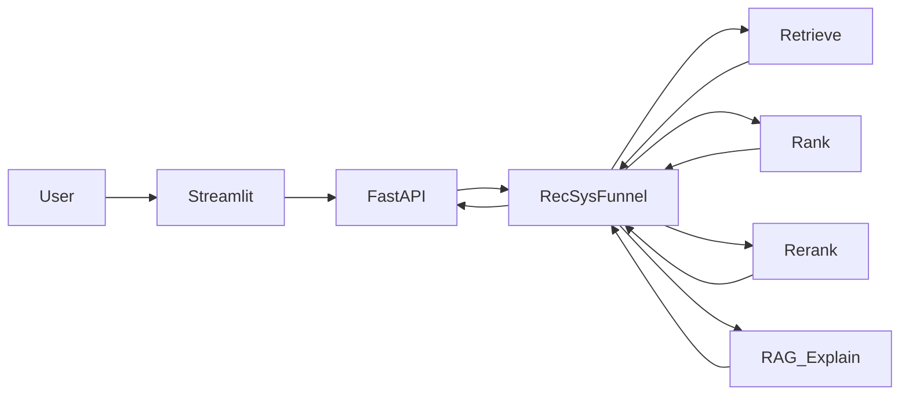

# Why This Product?

**이커머스 RecSys + RAG 쇼핑 어시스턴트 · multi-stage · FAISS · FastAPI**

카탈로그에서 multi-stage로 상품을 추천하고, RAG로 **“왜 이 상품인가”** 를 설명하는 솔로 플래그십 프로젝트입니다.

> 데모 GIF · 배포 링크는 MVP 이후 [docs/ROADMAP.md](docs/ROADMAP.md) Phase 6에서 추가합니다.

---

## 한 줄 요약

후보 생성(retrieve) → 랭킹 → 다양성 re-rank까지는 RecSys funnel이 담당하고,  
LLM은 **이미 좁혀진 후보 안에서만** 설명·선택합니다. 없는 ASIN을 지어내지 않습니다.

---

## 기술 스택

| 구분 | 기술 |
|------|------|
| Frontend | Streamlit |
| Backend | FastAPI |
| Retrieval | popularity (기본, `rating>=5` 카운트) + content FAISS + iALS. RRF·two-tower는 pop@10 미달 |
| Ranking | LightGBM / XGBoost / CatBoost 실험 후 서빙 off. 관련 R@10 최고 재정렬 0.0575 < pop 0.1900 |
| Re-rank | MMR `lambda_diversity=0.5` (`use_mmr` 기본 on). R@10 0.1700, ILD 0.864 |
| RAG | sentence-transformers, FAISS |
| LLM | OpenAI `gpt-4o-mini` (필수) |
| Data | Amazon Reviews 2018 **All_Beauty** |
| Language | Python |

---

## 아키텍처



자세한 모듈 책임: [docs/ARCHITECTURE.md](docs/ARCHITECTURE.md)

---

## MVP 범위

- popularity retrieve (기본, train `rating>=5` 카운트). content FAISS(`per_seed`) + iALS(`rating_ge_5`). RRF는 `use_hybrid`
- LightGBM / XGBoost / CatBoost rank (`use_ranker` 플래그만, 서빙 off). Phase 3에서 pop 0.1900이 이김. DeepFM 없음
- MMR 다양성 (`use_mmr` 기본 on, `lambda_diversity=0.5`). warm R@10 0.1700 / ILD 0.864
- RAG 기반 “왜 이 상품?” 설명 API / UI (`POST /api/explain`, `OPENAI_API_KEY` 필수)

이후 단계(비용·지연 리포트 → Docker)는 [docs/ROADMAP.md](docs/ROADMAP.md)를 보세요.

---

## 문서

| 문서 | 내용 |
|------|------|
| [docs/OVERVIEW.md](docs/OVERVIEW.md) | 문제 정의, 포지셔닝, Non-goals |
| [docs/ARCHITECTURE.md](docs/ARCHITECTURE.md) | funnel · 모듈 책임 |
| [docs/ROADMAP.md](docs/ROADMAP.md) | MVP → Phase 6 체크리스트 |
| [docs/DATA.md](docs/DATA.md) | 데이터셋 · 스키마 · temporal split |
| [docs/FIELDS.md](docs/FIELDS.md) | raw / processed 필드 사전 |
| [docs/EVAL.md](docs/EVAL.md) | 오프라인 지표 · 스모크 기준 |

---

## 프로젝트 구조

```text
.
├── backend/          # FastAPI
├── frontend/         # Streamlit
├── ml/               # retrieval · ranking · rerank · rag · eval
├── scripts/          # download · split · build_faiss · build_rag_index · train_* · eval_smoke · eval_rag
├── notebooks/        # EDA (exploratory)
├── configs/          # mvp.yaml
├── docs/
├── data/raw/         # gitignore (다운로드)
└── data/processed/   # 전처리·인덱스 (대용량은 gitignore)
```

---

## 설치 및 실행

### 1. 환경

```bash
git clone https://github.com/DaGoMi1/why-this-product.git
cd why-this-product

python -m venv .venv
# Windows: .venv\Scripts\activate
# macOS/Linux: source .venv/bin/activate

pip install -r requirements.txt
# 루트에 .env 생성 후 OPENAI_API_KEY 필수 (설명·후보 내 선택 — Phase 5)
```

### 2. 데이터 파이프라인 (Phase 1–5)

```bash
python -m scripts.download_data
python -m scripts.prepare_splits
python -m scripts.build_faiss
python -m scripts.build_rag_index
python -m scripts.train_ials
python -m scripts.train_two_tower
python -m scripts.train_ranker
python -m scripts.eval_smoke
python -m scripts.eval_rag
```

### 3. API

```bash
python -m uvicorn backend.main:app --reload
```

- Health: http://localhost:8000/health  
- Docs: http://localhost:8000/docs  
- Recommend: `POST /api/recommend` — `{"user_id": "..."}`는 popularity + MMR(`lambda_diversity=0.5`). `{"query": "hydrating serum"}`는 content FAISS + MMR (pop RRF 없음). `"use_mmr": false`면 각각 pop / content 점수 순서. CF만 `"use_ials": true`. RRF는 `"use_hybrid": true`(user_id만). 부스팅은 `"use_ranker": true`.
- Explain: `POST /api/explain` — `{"item_ids": ["B0..."], "query": "...", "select_k": 0}`. 후보 ASIN 안에서만 한두 문장. 키 없으면 **503**. `select_k>0`이면 그 목록의 부분집합만 고른다.

### 4. UI

```bash
python -m streamlit run frontend/app.py
```

기본은 영어 `query` 검색입니다. 화면에 영어 예시와 데모 `user_id` 5명이 있습니다. 추천 후 `POST /api/explain`을 호출합니다. API는 `API_URL`(기본 `http://127.0.0.1:8000`)입니다.

---

## 포지션

개인 프로젝트 — 데이터·모델링·서빙·RAG·문서까지 end-to-end.  
Boostcamp 대회/팀 포트폴리오를 **이커머스 multi-stage + 설명 가능 추천**으로 확장하는 메인 레포입니다.

---

## 라이선스

MIT License
