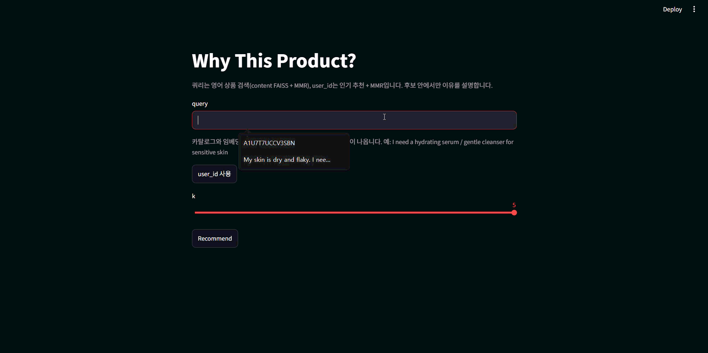
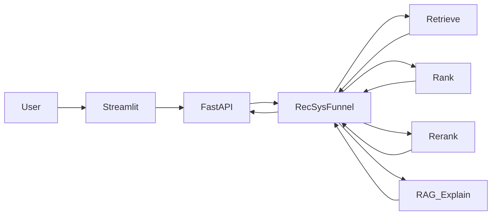

# Why This Product?

**이커머스 RecSys + RAG 쇼핑 어시스턴트 · multi-stage · FAISS · FastAPI**

카탈로그에서 multi-stage로 상품을 추천하고, RAG로 **“왜 이 상품인가”** 를 설명하는 솔로 플래그십 프로젝트입니다.



---

## 한 줄 요약

후보 생성(retrieve) → 랭킹 → 다양성 re-rank까지는 RecSys funnel이 담당하고,  
LLM은 **이미 좁혀진 후보 안에서만** 설명·선택합니다. 없는 ASIN을 지어내지 않습니다.

---

## 기술 스택


| 구분        | 기술                                                                                |
| --------- | --------------------------------------------------------------------------------- |
| Frontend  | Streamlit                                                                         |
| Backend   | FastAPI                                                                           |
| Retrieval | popularity (기본, `rating>=5` 카운트) + content FAISS + iALS. RRF·two-tower는 pop@10 미달 |
| Ranking   | LightGBM / XGBoost / CatBoost 실험 후 서빙 off. 관련 R@10 최고 재정렬 0.0575 < pop 0.1900     |
| Re-rank   | MMR `lambda_diversity=0.5` (`use_mmr` 기본 on). R@10 0.1700, ILD 0.864              |
| RAG       | sentence-transformers, FAISS                                                      |
| LLM       | OpenAI `gpt-4o-mini` (필수)                                                         |
| Data      | Amazon Reviews 2018 **All_Beauty**                                                |
| Language  | Python                                                                            |
| Tooling   | Cursor                                                                            |


---


## 아키텍처




자세한 모듈 책임: [docs/ARCHITECTURE.md](docs/ARCHITECTURE.md)

---


## MVP 범위

- popularity retrieve (기본, train `rating>=5` 카운트). content FAISS(`per_seed`) + iALS(`rating_ge_5`). RRF는 `use_hybrid`
- LightGBM / XGBoost / CatBoost rank (`use_ranker` 플래그만, 서빙 off). Phase 3에서 pop 0.1900이 이김. DeepFM 없음
- MMR 다양성 (`use_mmr` 기본 on, `lambda_diversity=0.5`). warm R@10 0.1700 / ILD 0.864
- RAG 기반 “왜 이 상품?” 설명 API / UI (`POST /api/explain`, `OPENAI_API_KEY` 필수). 사유는 한글, 검색 쿼리는 영어. 사유 아래 스니펫 인용
- Phase 7: 쿼리 gold·미탐/오탐·카탈로그 속성 품질 ([docs/LABELING.md](docs/LABELING.md) / [docs/EVAL.md](docs/EVAL.md)). FAISS+MMR vs gold mean P@10 0.36. 서빙 채널·`user_id` API는 그대로. CI·배포는 범위 밖
- Docker Compose (API + UI). 요청 `timings_ms`: retrieve / rank / rerank / rag

단계별 실험·탈락 이유는 [docs/ROADMAP.md](docs/ROADMAP.md) / [docs/EVAL.md](docs/EVAL.md).

---


## 문서


| 문서                                           | 내용                          |
| -------------------------------------------- | --------------------------- |
| [docs/OVERVIEW.md](docs/OVERVIEW.md)         | 문제 정의, 포지셔닝, Non-goals      |
| [docs/ARCHITECTURE.md](docs/ARCHITECTURE.md) | funnel · 모듈 책임              |
| [docs/ROADMAP.md](docs/ROADMAP.md)           | Phase 0–7 체크리스트              |
| [docs/LABELING.md](docs/LABELING.md)         | 쿼리 적합성 라벨 규칙               |
| [docs/DATA.md](docs/DATA.md)                 | 데이터셋 · 스키마 · temporal split |
| [docs/FIELDS.md](docs/FIELDS.md)             | raw / processed 필드 사전       |
| [docs/EVAL.md](docs/EVAL.md)                 | 오프라인 지표 · 스모크 기준            |


---


## 프로젝트 구조

```text
.
├── backend/          # FastAPI
├── frontend/         # Streamlit
├── ml/               # retrieval · ranking · rerank · rag · eval
├── scripts/          # download · split · build_faiss · build_rag_index · train_* · eval_* · catalog quality
├── notebooks/        # EDA (exploratory)
├── configs/          # mvp.yaml
├── docs/             # 설계·평가. demo.gif
├── Dockerfile
├── docker-compose.yml
├── data/raw/         # gitignore (다운로드)
└── data/processed/   # 전처리·인덱스 (대용량은 gitignore)
```

---


## 설치 및 실행


### 1. 환경

```bash
git clone https://github.com/DaGoMi1/why-this-product.git
cd why-this-product

python -m venv .venv
# Windows: .venv\Scripts\activate
# macOS/Linux: source .venv/bin/activate

pip install -r requirements.txt
# 루트에 .env 생성 후 OPENAI_API_KEY 필수 (설명·후보 내 선택 — Phase 5)
```


### 2. 데이터 파이프라인

서빙에 필요한 최소:

```bash
python -m scripts.download_data
python -m scripts.prepare_splits
python -m scripts.build_faiss
python -m scripts.build_rag_index
```

실험 재현(iALS·two-tower·랭커·스모크). 서빙 기본 채널은 아님:

```bash
python -m scripts.train_ials
python -m scripts.train_two_tower
python -m scripts.train_ranker
python -m scripts.eval_smoke
python -m scripts.eval_rag
python -m scripts.bench_explain_latency
python -m scripts.build_query_gold
python -m scripts.report_catalog_quality
python -m scripts.eval_query
```


### 3. API

```bash
python -m uvicorn backend.main:app --reload
```

- Health: [http://localhost:8000/health](http://localhost:8000/health)  
- Docs: [http://localhost:8000/docs](http://localhost:8000/docs)  
- Recommend: `POST /api/recommend` — `{"user_id": "..."}`는 popularity + MMR(`lambda_diversity=0.5`). `{"query": "hydrating serum"}`는 content FAISS + MMR (pop RRF 없음). `"use_mmr": false`면 각각 pop / content 점수 순서. CF만 `"use_ials": true`. RRF는 `"use_hybrid": true`(user_id만). 부스팅은 `"use_ranker": true`.
- Explain: `POST /api/explain` — `{"item_ids": ["B0..."], "query": "...", "select_k": 0}`. 후보 ASIN 안에서만 한두 문장. 키 없으면 **503**. `select_k>0`이면 그 목록의 부분집합만 고른다.


### 4. UI

```bash
python -m streamlit run frontend/app.py
```

기본은 영어 `query` 검색입니다. 카탈로그·임베딩이 영어라 `I need a hydrating serum`처럼 써야 합니다. 화면에 예시 문장과 데모 `user_id` 5명이 있습니다. 추천 후 `POST /api/explain`을 호출하고, 사유 아래에 영어 스니펫을 인용합니다. API는 `API_URL`(기본 `http://127.0.0.1:8000`)입니다.

### 5. Docker Compose

로컬에 `data/processed`(FAISS·parquet)와 루트 `.env`(`OPENAI_API_KEY`)가 있어야 합니다.

```bash
docker compose up --build
```

- API: [http://localhost:8000/health](http://localhost:8000/health)  
- UI: [http://localhost:8501](http://localhost:8501)

데이터와 인덱스는 이미지에 넣지 않고 `data/processed`를 마운트합니다.

---


## 포지션

개인 프로젝트 — 데이터·모델링·서빙·RAG·문서까지 end-to-end.  
구현과 문서 정리에 **Cursor**를 사용했습니다.  
앞선 프로젝트의 경험을 합쳐 **이커머스 multi-stage + 설명 가능 추천**으로 확장하는 레포입니다.

---


## 라이선스

MIT License