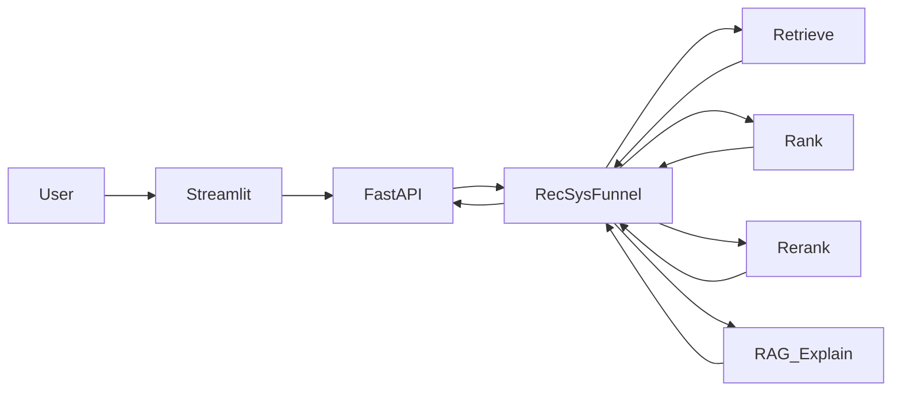

# Architecture

## 한눈에



설정 기본값: [`configs/mvp.yaml`](../configs/mvp.yaml)

## 레이어 책임

| 레이어 | 패키지 | 책임 |
|--------|--------|------|
| Serving | `backend/` | HTTP API, 스키마, 요청 오케스트레이션 |
| UI | `frontend/` | Streamlit 데모 (유저/쿼리 입력 → 추천·설명) |
| Retrieve | `ml/retrieval/` | popularity, content FAISS, iALS. two-tower는 짧게 실험 후 탈락 (이후 hybrid) |
| Rank | `ml/ranking/` | MVP score blend → 랭커 미정 (LightGBM 등 부스팅, DeepFM 등 DL, LTR 후보를 ablation으로 선정) |
| Re-rank | `ml/rerank/` | MMR, 카테고리·브랜드 다양성, 비즈니스 룰 |
| RAG | `ml/rag/` | 상품 문서 검색 + OpenAI 설명/선택 (후보 id만, API 키 필수) |
| Embeddings | `ml/embeddings/` | sentence-transformers 래퍼 |
| Vectorstore | `ml/vectorstore/` | FAISS 로드/검색 |
| Eval | `ml/eval/` | Recall@K, NDCG@K, coverage, latency |

## 요청 흐름 (목표)

1. `POST /api/recommend` — user_id 또는 seed item / query
2. Retrieve: popularity ∪ content ANN → 후보 집합
3. Rank: 점수화 후 top-N
4. Re-rank: MMR로 final_k
5. (옵션) `POST /api/explain` — 각 ASIN에 대해 메타+리뷰 근거로 설명
6. 응답: `{ items: [{asin, score, reason?}], latency_ms }`

## LLM 경계

- 입력: 이미 funnel이 고른 후보 id + 메타/리뷰 스니펫
- 출력: 설명 문장 또는 `SELECTED_IDS` 형태의 id 목록
- 금지: 후보에 없는 ASIN, 가격·재고 등 근거 없는 사실 단정

이 패턴은 [busan-trip-rag](https://github.com/DaGoMi1/busan-trip-rag)의 “후보 안에서만 LLM 선택”과 동일합니다.

## 디렉터리 맵

```text
backend/          # FastAPI app, routers, schemas, services
frontend/         # Streamlit
ml/retrieval/     # 후보 생성
ml/ranking/       # 순위 학습·추론
ml/rerank/        # 다양성·룰
ml/rag/           # 설명·OpenAI LLM (필수)
ml/embeddings/    # 임베딩
ml/vectorstore/   # FAISS
ml/eval/          # 오프라인 평가
scripts/          # CLI 파이프라인
configs/          # Hydra-less YAML
data/raw|processed/
```

스캐폴딩 단계에서는 패키지 docstring·스텁만 존재합니다. 구현은 [ROADMAP.md](ROADMAP.md) 순서를 따릅니다.
