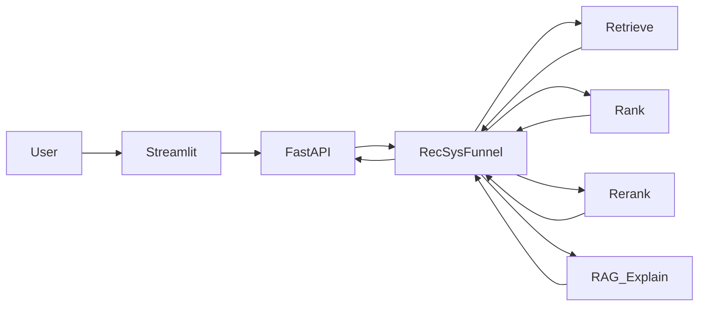

# Architecture

## 한눈에



설정 기본값: [`configs/mvp.yaml`](../configs/mvp.yaml)

## 레이어 책임

| 레이어 | 패키지 | 책임 |
|--------|--------|------|
| Serving | `backend/` | HTTP API, 스키마, 요청 오케스트레이션 |
| UI | `frontend/` | Streamlit 데모. 기본은 영어 query. `user_id`는 인기+MMR |
| Retrieve | `ml/retrieval/` | popularity (기본, `rating>=5` 카운트), content FAISS, iALS. RRF로 합칠 수 있음. two-tower 탈락 |
| Rank | `ml/ranking/` | LightGBM / XGBoost / CatBoost (`use_ranker`, 실험 후 서빙 off). 선정은 popularity 단일 |
| Re-rank | `ml/rerank/` | MMR (`use_mmr` 기본 on, `lambda_diversity=0.5`). sim=임베딩 코사인 |
| RAG | `ml/rag/` | 상품 문서 검색 + OpenAI 설명/선택 (후보 id만, API 키 필수). 스니펫은 쿼리 lexical+dense로 고르고 UI에 인용 |
| Embeddings | `ml/embeddings/` | sentence-transformers 래퍼 |
| Vectorstore | `ml/vectorstore/` | FAISS 로드/검색 |
| Eval | `ml/eval/` | Recall@K, NDCG@K, coverage, ILD, 쿼리 gold 미탐/오탐 |

## 요청 흐름

1. `POST /api/recommend` — `user_id` 또는 `query`
2. Retrieve: `user_id`는 popularity top-200. `query`는 content FAISS(`content_faiss_top_k`). `use_hybrid`면 user_id만 pop ∪ iALS ∪ content를 RRF
3. Rank: `user_id` 기본은 retrieve 순서(popularity). `use_ranker`는 플래그만 — 부스팅은 pop@10을 못 넘겨 서빙 off. 쿼리는 랭커 없음
4. Re-rank: 기본 MMR(`lambda_diversity=0.5`). `"use_mmr": false`면 `user_id`는 pop 순서, `query`는 content 점수 순서
5. `POST /api/explain` — 이미 고른 `item_ids`(1–10)만. 설명용 RAG FAISS에서 해당 ASIN 스니펫을 **쿼리 조건(lexical overlap + dense)** 으로 고른 뒤 `gpt-4o-mini`가 한국어 한두 문장. 스니펫은 영어 원문이며 UI에 인용한다. `select_k>0`이면 후보 안 부분집합만. `OPENAI_API_KEY` 없으면 **503**
6. 추천 응답은 `{ items, strategy, timings_ms, ... }`. `timings_ms`는 retrieve / rank / rerank. 설명 응답은 `{ items: [{item_id, reason, snippets}], selected_ids, model, tokens, timings_ms.rag }`

retrieve FAISS(`data/processed/faiss_index/`)와 RAG 청크 FAISS(`data/processed/rag_index/`)는 분리한다. 청크는 train 메타 + train 리뷰만.

## LLM 경계

- 입력: 이미 funnel이 고른 후보 id + 메타/리뷰 스니펫
- 출력: 설명 문장 또는 `SELECTED_IDS` 형태의 id 목록
- 금지: 후보에 없는 ASIN, 가격·재고, 스니펫에 없는 성분·효과 단정

이 패턴은 [busan-trip-rag](https://github.com/DaGoMi1/busan-trip-rag)의 “후보 안에서만 LLM 선택”과 동일합니다.

## 디렉터리 맵

```text
backend/          # FastAPI app, routers, schemas, services
frontend/         # Streamlit
ml/retrieval/     # 후보 생성
ml/ranking/       # 순위 학습·추론
ml/rerank/        # 다양성·룰
ml/rag/           # 설명·OpenAI LLM (필수)
ml/embeddings/    # 임베딩
ml/vectorstore/   # FAISS
ml/eval/          # 오프라인 평가
scripts/          # CLI 파이프라인
configs/          # Hydra-less YAML
Dockerfile        # API·UI 동일 이미지
docker-compose.yml
data/raw|processed/
docs/             # 설계·EVAL·demo.gif
```

구현 순서는 [ROADMAP.md](ROADMAP.md)를 따릅니다.
